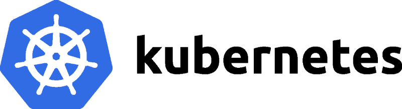

# Kubernetes Mastery

```console
      __  __           __                                            __                       
     /\ \/\ \         /\ \                                          /\ \__                 
     \ \ \/'/'  __  __\ \ \____     __   _ __    ___      __    ____\ \ ,_\    __    ____  
      \ \ , <  /\ \/\ \\ \ '__`\  /'__`\/\`'__\/' _ `\  /'__`\ /',__\\ \ \/  /'__`\ /',__\ 
       \ \ \\`\\ \ \_\ \\ \ \L\ \/\  __/\ \ \/ /\ \/\ \/\  __//\__, `\\ \ \_/\  __//\__, `\
        \ \_\ \_\ \____/ \ \_,__/\ \____\\ \_\ \ \_\ \_\ \____\/\____/ \ \__\ \____\/\____/
         \/_/\/_/\/___/   \/___/  \/____/ \/_/  \/_/\/_/\/____/\/___/   \/__/\/____/\/___/
      ___             _           _                         
     |  _|___ ___ _ _| |_ ___ _ _| |___ ___  
     |  _| .'|  _| | | '_| . | | | | -_|  _|
WWW .|_| |__,|_| |___|_,_|  _|___|_|___|_|.COM

Name: Kubernetes Mastery
POC: Debian 12 "Bookworm"
Author: faruk guler
Date: 2026
```



---

## 📖 İçindekiler

`Kubernetes Mastery`, her biri belirli bir alana odaklanan 17 ana bölümden oluşmaktadır:

| Bölüm | Konu Başlığı | Temel İçerik / Dosyalar |
| :--- | :--- | :--- |
| 🚀 **Core Concepts** | [Temel Kavramlar](Core_Concepts/) | [Kubernetes Nedir](Core_Concepts/What%20is%20Kubernetes.md), [Mimari](Core_Concepts/Architecture%20%26%20Components.md), [Pod Yapısı](Core_Concepts/Pods%20%26%20Objects.md), [Probelar](Core_Concepts/Liveness%20Probe%20%26%20Readiness%20Probe.md), [Deployment](Core_Concepts/Deployment%20Deep%20Dive.md), [kubectl Cheatsheet](Core_Concepts/kubectl%20Cheatsheet.md), [CNCF Haritası](Core_Concepts/CNCF%20Ecosystem%20Map.md) |
| 🌐 **Networking** | [Ağ Teknolojileri](Networking/) | [Cilium eBPF](Networking/Cilium%20eBPF.md), [Gateway API](Networking/Gateway%20API.md), [DNS](Networking/DNS%20%26%20CoreDNS.md), [Network Policy](Networking/Network%20Policy.md), [Service & Ingress](Networking/Service%20%26%20Ingress.md) |
| 💾 **Storage** | [Depolama Çözümleri](Storage/) | [PV, PVC & StorageClass](Storage/PV%2C%20PVC%20%26%20StorageClass.md), [CSI Drivers](Storage/CSI%20Drivers%20%26%20Dynamic%20Provisioning.md), [StatefulSet](Storage/StatefulSet%20%26%20Storage%20Patterns.md) |
| 🔒 **Security** | [Güvenlik Standartları](Security/) | [RBAC](Security/Role-based%20Access%20Control%20%28RBAC%29.md), [Kyverno](Security/Kyverno%20Policy%20Engine.md), [Pod Security](Security/Pod%20Security%20Standards.md), [Falco](Security/Runtime%20Security%20-%20Falco.md), [Secret CSI](Security/Secrets%20Store%20CSI%20Driver.md) |
| 🛠️ **Infrastructure & Ops** | [Altyapı ve Operasyon](Infrastructure_and_Operations/) | [Kubeadm Kurulumu](Infrastructure_and_Operations/Kubeadm%20Installation.md), [Cluster Upgrade](Infrastructure_and_Operations/Cluster%20Upgrade.md), [etcd Yedekleme/Kurtarma](Infrastructure_and_Operations/etcd%20Backup%20%26%20Restore.md), [KEDA](Infrastructure_and_Operations/KEDA%20Autoscaling.md) |
| 📊 **Observability** | [Gözlemlenebilirlik](Observability/) | Prometheus, Grafana, Jaeger, OpenTelemetry |
| 📦 **App Delivery & GitOps**| [Uygulama Dağıtımı](Application_Delivery_GitOps/) | ArgoCD, Flux, Helm, Kustomize, Progressive Delivery |
| 🔍 **Troubleshooting** | [Hata Ayıklama](Troubleshooting/) | Pod/Container Hataları, Storage, Network, Control Plane Hataları |
| 🧱 **Platform Engineering** | [Platform Mühendisliği](Platform_Engineering/) | Backstage, Crossplane, vCluster, IDP |
| 🤖 **AI & Machine Learning** | [AI / ML Yönetimi](AI_Machine_Learning/) | Kubeflow, Ray, KServe, GPU Operators |
| 🔗 **Multi-Cluster & Edge** | [Çoklu Cluster & Edge](Multi_Cluster_Edge/) | Cluster API, Karmada, Edge K3s |
| 🗺️ **Migration & Adoption** | [Geçiş ve Sertifikasyon](Migration_Adoption/) | [CKA/CKAD/CKS Hazırlık](Migration_Adoption/CKA%20CKAD%20CKS%20Certification%20Guide.md), Adoption Roadmap |
| 🖼️ **Image & Container Mgmt**| [İmaj Yönetimi](Image_Container_Management/) | Image Scanning, SBOM, Registry |
| 📐 **Architecture Patterns**| [Mimari Tasarım](Architecture_Design_Patterns/) | High Availability, Capacity Planning, Cost Optimization |
| 📑 **Appendix** | [Ekler & YAML Kılavuzu](Appendix/) | Core Workloads YAML şablonları |

---

## Kubernetes'e Başlarken

Bu bir "komut kılavuzu" değildir. İnternette binlerce `kubectl get pods` örneği var. Bu kitabı yazmamın sebebi, Kubernetes'i *gerçekten* anlamak; yani bir şey bozulduğunda nereye bakacağını bilmek, bir mimari kararı neden aldığını savunabilmek, ve bir sistemi sıfırdan inşa edip ayakta tutabilmek için gereken zihinsel modeli kurmak.

Bunu okuduktan sonra Kubernetes'i "kullanan" biri değil, Kubernetes üzerinde *düşünen* biri olacaksınız.

---

## Bir Sorunun Tarihi

2000'lerin başında bir web uygulaması deploy etmek şu anlama geliyordu: bir sunucu kirala, üzerine işletim sistemi kur, bağımlılıkları elle yükle, uygulamayı çalıştır, ve dua et. Sunucu çöktüğünde sen de çökerdin. Ölçeklendirmek istediğinde yeni bir sunucu satın alırdın — haftalar sürerdi.

Sonra **sanallaştırma** geldi. Bir fiziksel makine üzerinde onlarca sanal makine çalıştırabilir olduk. Bu büyük bir adımdı, ama asıl devrim henüz gelmemişti.

2013'te Docker çıktı. Uygulama ve bağımlılıklarını tek bir paket — *container* — içine koymak mümkün hale geldi. Artık "bende çalışıyor ama production'da çalışmıyor" dönemi sona erdi. Her ortamda aynı container, aynı davranış.

Fakat yeni bir problem ortaya çıktı: **Yüzlerce, binlerce container'ı kim yönetecek?**

- Hangi container hangi sunucuda çalışacak?
- Container çöktüğünde kim yeniden başlatacak?
- Trafik arttığında kim yeni kopyalar oluşturacak?
- Güncelleme sırasında servis kesintisi olmayacaksa orchestration nasıl yapılacak?

Google bu soruyla 2000'lerin başından beri boğuşuyordu. Gmail, Search, YouTube — hepsi aynı iç sistemde çalışıyordu: **Borg**. On yıllar boyunca Borg üzerinde biriken deneyim ve dersler, 2014'te açık kaynak olarak dünyaya sunuldu. Adı: **Kubernetes**.

Yunanca'da *dümenci* anlamına gelir. Gemiyi hedefine götüren, fırtınada rotayı koruyan kişi.

---

## Kubernetes Ne Değildir

Kubernetes'i anlamanın en iyi yolu, ne *olmadığını* bilmekten geçer.

**Kubernetes bir PaaS değildir.** Heroku veya Google App Engine gibi "kodunu ver, gerisini ben yaparım" demez. Size altyapı üzerinde tam kontrol verir ama bu kontrolün sorumluluğunu da size bırakır.

**Kubernetes bir container runtime değildir.** Docker veya containerd container'ları çalıştırır; Kubernetes ise bu container'ların *nerede, ne zaman, kaç tane* çalışacağına karar verir.

**Kubernetes sihir değildir.** Her şey Linux kernel'inin primitive'leri üzerine inşa edilmiştir: `cgroups`, `namespaces`, `iptables` veya `eBPF`. Kubernetes bu mekanizmaları soyutlar, ama altında hep aynı temel var.

---

## Temel Felsefe: Bildirimsel Yönetim

Kubernetes'in en devrimci fikri teknik bir özellik değil, bir *düşünce biçimidir*.

Geleneksel sistem yönetiminde emirler verirsiniz: "Şu sunucuya git, şu servisi başlat, şu portu aç." Bu **imperative** (buyurucu) yaklaşımdır.

Kubernetes tam tersi bir yol izler. Siz sadece *istediğiniz durumu* tarif edersiniz:

> "Bu uygulamadan her zaman 3 kopya çalışmalı. 512MB'dan fazla RAM kullanmamalı. 80 portuna gelen trafik bunlara dağıtılmalı."

Kubernetes bunu bir YAML dosyasına yazmanızı bekler ve sonra **sonsuza kadar bu durumu korumaya çalışır**. Bir kopya çöktüğünde yenisini başlatır. Sunucu kapandığında pod'ları başka sunucuya taşır. Siz bir şey yapmanıza gerek kalmaz.

Bu yaklaşıma **declarative (bildirimsel) model** denir ve bir cluster'ın nasıl yönetileceği konusundaki en güçlü paradigma değişikliğidir. YAML dosyalarınız artık sadece yapılandırma değil, sistemin *gerçeğinin* tek kaynağıdır — **Single Source of Truth**.

---

## Control Loop: Sonsuz Uzlaşma Döngüsü

Kubernetes'in kalbinde bir mekanizma vardır: **Reconciliation Loop** (Uzlaşma Döngüsü).

Her controller şunu sürekli yapar:

```text
İstenen Durum (Desired State)  ←→  Mevcut Durum (Actual State)
         ↑                                    ↑
    "3 replica olsun"              "Şu an 2 replica çalışıyor"
                    ↓
              Fark tespit edildi → Yeni pod başlat
```

Bu döngü saniyede onlarca kez çalışır. Cluster hiçbir zaman "tamamlandı" durumuna ulaşmaz; her zaman istenen duruma doğru *yaklaşmaya* çalışır. Bu felsefi bir nokta değil, pratik bir güçtür: sisteminiz kendi kendini iyileştirir (*self-healing*).

---

## Mimari: Kimin Kim Olduğu

Kubernetes bir cluster'dan oluşur. Cluster içinde iki tip makine vardır.

**Control Plane (Kontrol Düzlemi):** Beyin. API Server, Scheduler, Controller Manager ve etcd burada çalışır. Kararlar burada alınır.

**Worker Nodes (İşçi Düğümleri):** Kaslar. Uygulamalarınız burada çalışır. Her node üzerinde bir `kubelet` (node'un Kubernetes ajanı) ve bir container runtime (containerd) bulunur.

Aralarındaki iletişim tek yönlüdür: Worker node'lar hiçbir zaman birbirlerine veya Control Plane'e emir vermez. Her şey **API Server** üzerinden geçer. `kubectl` komutunuz bile sadece API Server'a bir HTTP isteğidir.

`etcd` ise cluster'ın hafızasıdır — dağıtık, tutarlı bir anahtar-değer veritabanı. Cluster'da olan her şey burada kayıtlıdır. etcd giderse Kubernetes kör olur; ne yapacağını bilemez.

---

## Neden 2026'da Hâlâ Öğrenilmeli?

Kubernetes 2014'te çıktı. "Olgunlaştı, eskidi" diyenler var. Yanlış.

2026 itibarıyla Kubernetes, sektörde *de facto* standart olmaya devam ediyor. AWS, Azure, GCP, Alibaba, Huawei — hepsi yönetilen Kubernetes servisi sunuyor. Fortune 500 şirketlerin büyük çoğunluğu iş yüklerini Kubernetes üzerinde çalıştırıyor.

Dahası, Kubernetes artık sadece web uygulamalarını değil; **GPU iş yüklerini** (büyük dil modelleri, ML training), **edge computing**'i (fabrika sensörleri, baz istasyonları), **sanal makineleri** (KubeVirt), ve **serverless iş yüklerini** (Knative) de yönetiyor.

Kubernetes öğrenmek, bir ürün öğrenmek değil; dağıtık sistemlerin ortak dilini öğrenmektir.

---

## Bu Kitabı Nasıl Okumalısınız?

Baştan sona doğrusal okumak zorunda değilsiniz — ama **Core Concepts** bölümünü atlamayın. Geri kalan her şeyin temeli orada.

Bir konuyu okuduktan hemen sonra terminal açın. Kubernetes teoride değil, parmak uçlarında öğrenilir. Kıran, bozan, düzelten biri olun.

Her bölümün sonunda YAML örnekleri var. Bunlar dekorasyon değil — kopyalayın, değiştirin, cluster'ınıza uygulayın, ne olduğunu izleyin.

Ve bir şey bozulduğunda paniklemeden önce şunu sorun: *"Kubernetes şu an ne yapmaya çalışıyor?"* Cevabı genellikle `kubectl describe` ve `kubectl logs` içindedir.

---

> *"The ships hung in the sky in much the same way that bricks don't."*
>
> "Gemiler gökyüzünde tıpkı tuğlaların havada asılı kalmaması gibi asılı duruyordu."
 — Douglas Adams
---

```text
Teşekkürler:
https://mstryoda.github.io/kubernetes-kitap/
https://k8s-tr.github.io/k8s-docs/
https://k8s.1w2.net/
```
