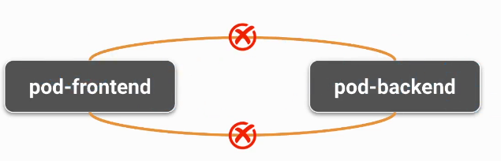
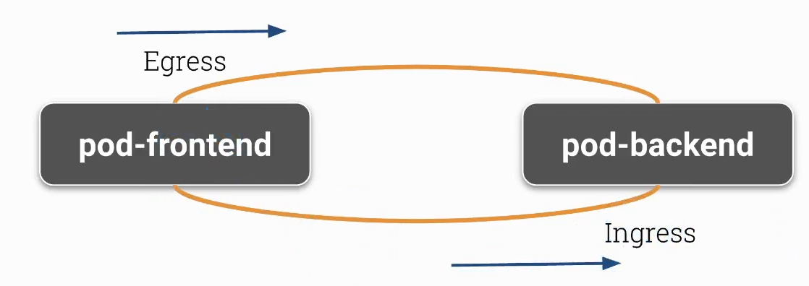

# NetworkPolicy Derinlemesine İnceleme



Pod A'nın Pod B'ye erişmesini istiyorsanız:

    Pod A için egress (çıkış) izinleri belirtmelisiniz.
    Pod B için ingress (giriş) izinleri belirtmelisiniz.




```bash
minikube start --network-plugin=cni --cni=cilium

kubectl create namespace network-policy-tutorial


kubectl run backend --image=nginx --namespace=network-policy-tutorial
kubectl run database --image=nginx --namespace=network-policy-tutorial
kubectl run frontend --image=nginx --namespace=network-policy-tutorial

kubectl get pods --namespace=network-policy-tutorial


kubectl expose pod backend --port 80 --namespace=network-policy-tutorial
kubectl expose pod database --port 80 --namespace=network-policy-tutorial
kubectl expose pod frontend --port 80 --namespace=network-policy-tutorial


kubectl get service --namespace=network-policy-tutorial


kubectl exec -it frontend --namespace=network-policy-tutorial -- curl <BACKEND-CLUSTER-IP>

kubectl exec -it frontend --namespace=network-policy-tutorial -- curl <DATABASE-CLUSTER-IP>


```

## Bir Namespace İçindeki Trafiği Sınırlandırma


```yaml
apiVersion: networking.k8s.io/v1
kind: NetworkPolicy
metadata:
  name: namespace-default-deny
  namespace: network-policy-tutorial
spec:
  podSelector: {}
  policyTypes:
  - Ingress
  - Egress

```

```bash
kubectl apply -f namespace-default-deny.yaml --namespace=network-policy-tutorial
```


```bash
kubectl exec -it frontend --namespace=network-policy-tutorial -- curl <BACKEND-CLUSTER-IP>

kubectl exec -it frontend --namespace=network-policy-tutorial -- curl <DATABASE-CLUSTER-IP>

```

### Belirli Pod'lardan Gelen Trafiğe İzin Verme

Frontend -> Backend -> Database


```yaml
apiVersion: networking.k8s.io/v1
kind: NetworkPolicy
metadata:
  name: frontend-default
  namespace: network-policy-tutorial
spec:
  podSelector:
    matchLabels:
      run: frontend
  policyTypes:
    - Egress
  egress:
    - to:
        - podSelector:
            matchLabels:
              run: backend
```

```bash

kubectl apply -f frontend-default-policy.yaml --namespace=network-policy-tutorial

```


```yaml
apiVersion: networking.k8s.io/v1
kind: NetworkPolicy
metadata:
  name: backend-default
  namespace: network-policy-tutorial
spec:
  podSelector:
    matchLabels:
      run: backend
  policyTypes:
    - Ingress
    - Egress
  ingress:
    - from:
        - podSelector:
            matchLabels:
              run: frontend
  egress:
    - to:
        - podSelector:
            matchLabels:
              run: database

```


```bash
kubectl apply -f backend-default-policy.yaml --namespace=network-policy-tutorial


```

```yaml
apiVersion: networking.k8s.io/v1
kind: NetworkPolicy
metadata:
  name: database-default
  namespace: network-policy-tutorial
spec:
  podSelector:
    matchLabels:
      run: database
  policyTypes:
    - Ingress
  ingress:
    - from:
        - podSelector:
            matchLabels:
              run: backend


```

```bash
kubectl apply -f database-default-policy.yaml --namespace=network-policy-tutorial

kubectl exec -it frontend --namespace=network-policy-tutorial -- curl <BACKEND-CLUSTER-IP>
kubectl exec -it backend --namespace=network-policy-tutorial -- curl <DATABASE-CLUSTER-IP>


kubectl exec -it backend --namespace=network-policy-tutorial -- curl <FRONTEND-CLUSTER-IP>
kubectl exec -it database --namespace=network-policy-tutorial -- curl <FRONTEND-CLUSTER-IP>
kubectl exec -it database --namespace=network-policy-tutorial -- curl <BACKEND-CLUSTER-IP>

```


### Hepsini Reddet (İlk Politika)

```bash
echo "
apiVersion: networking.k8s.io/v1
kind: NetworkPolicy
metadata:
  name: default-deny
spec:
  podSelector: {}
  policyTypes:
  - Ingress
  - Egress
" | kubectl apply -f -

```


1. A Pod with the label `app: my-app`:
```yaml
apiVersion: v1
kind: Pod
metadata:
  name: my-app-pod
  labels:
    app: my-app
spec:
  containers:
  - name: nginx
    image: nginx:1.27.0
```

2. A Pod with the label `role: frontend`:
```yaml
apiVersion: v1
kind: Pod
metadata:
  name: frontend-pod
  labels:
    role: frontend
spec:
  containers:
  - name: nginx
    image: nginx:1.27.0
```

3. A Pod with the label `role: backend`:
```yaml
apiVersion: v1
kind: Pod
metadata:
  name: backend-pod
  labels:
    role: backend
spec:
  containers:
  - name: nginx
    image: nginx:1.27.0
```

** network policy **

```yaml
apiVersion: networking.k8s.io/v1
kind: NetworkPolicy
metadata:
  name: my-network-policy
spec:
  podSelector:
    matchLabels:
      app: my-app
  policyTypes:
  - Ingress
  - Egress
  ingress:
  - from:
    - podSelector:
        matchLabels:
          role: frontend
    ports:
    - protocol: TCP
      port: 80
  egress:
  - to:
    - podSelector:
        matchLabels:
          role: backend
    ports:
    - protocol: TCP
      port: 80
```

```yaml
apiVersion: networking.k8s.io/v1
kind: NetworkPolicy
metadata:
  name: my-network-policy-3
spec:
  podSelector:
    matchLabels:
      role: frontend
  policyTypes:
  - Egress
  egress:
  - to:
    - podSelector:
        matchLabels:
          app: my-app
    ports:
    - protocol: TCP
      port: 80

---

apiVersion: networking.k8s.io/v1
kind: NetworkPolicy
metadata:
  name: my-network-policy-4
spec:
  podSelector:
    matchLabels:
      role: backend
  policyTypes:
  - Ingress
  ingress:
  - from:
    - podSelector:
        matchLabels:
          app: my-app
    ports:
    - protocol: TCP
      port: 80
```


### Örnek 3

```yaml

apiVersion: networking.k8s.io/v1
kind: NetworkPolicy
metadata:
  name: app
spec:
  podSelector:
    matchLabels:
      app: app-ui
  policyTypes:
    - Egress
  egress:
    - to:
        - ipBlock:
            cidr: 10.10.10.10/32
      ports:
        - port: 443
    - to:
        - ipBlock:
            cidr: 169.254.25.10/32
      ports: 
        - protocol: UDP
          port: 53

--- 

apiVersion: networking.k8s.io/v1
kind: NetworkPolicy
metadata:
  name: app
spec:
  podSelector:
    matchLabels:
      app: app-ui
  policyTypes:
    - Egress
  egress:
    - to:
        - ipBlock:
            cidr: 10.10.10.10/32
      ports:
        - port: 443
    - ports: 
        - protocol: UDP
          port: 53

--- 

apiVersion: networking.k8s.io/v1
kind: NetworkPolicy
metadata:
  name: assets
spec:
  podSelector:
    matchLabels:
      app: assets
  policyTypes:
    - Egress
  egress: []

```


## Namespace Seçici (Namespace Selector)

```yaml
apiVersion: networking.k8s.io/v1
kind: NetworkPolicy
metadata:
  name: allow-frontend
  namespace: target-namespace
spec:
  podSelector:
    matchLabels:
      app: my-app
  policyTypes:
  - Ingress
  ingress:
  - from:
    - namespaceSelector:
        matchLabels:
          ns: banka

```

```yaml

apiVersion: networking.k8s.io/v1
kind: NetworkPolicy
metadata:
  name: allow-specific-namespace
  namespace: target-namespace
spec:
  podSelector:
    matchLabels:
      app: my-app
  policyTypes:
  - Ingress
  ingress:
  - from:
    - namespaceSelector:
        matchExpressions:
        - key: kubernetes.io/metadata.name
          operator: In
          values:
          - specific-namespace
```


**Editor**

https://editor.networkpolicy.io/
