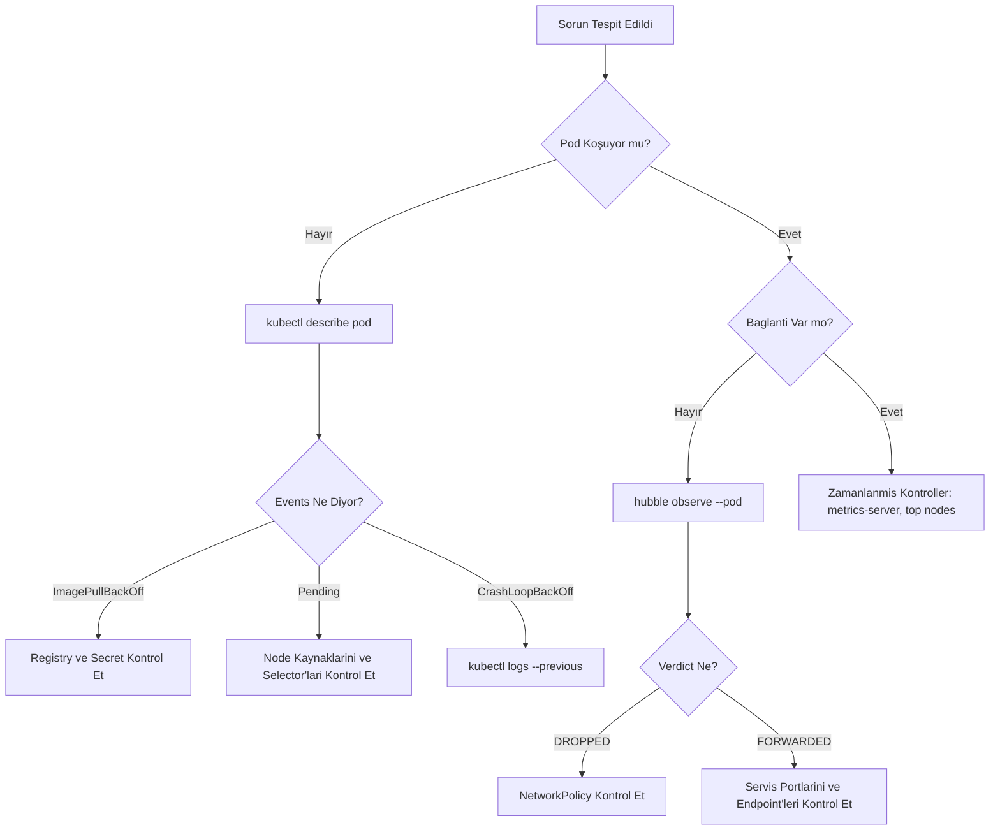

# 🛠️ Kubernetes Troubleshooting Masterclass (2026)

Bu rehber, bir Kubernetes mühendisinin en zorlu anlarda başvurduğu "Olay Müdahale Protokolü"dür. 2026 standartlarında, geleneksel yöntemlerin ötesinde eBPF tabanlı gözlemlenebilirlik ve ephemeral (geçici) debug konteynerleri merkeze alınmıştır.

## 🚩 Temel Hata Ayıklama Akışı

Aşağıdaki diyagram, bir Pod hatasıyla karşılaştığınızda izlemeniz gereken standart yolu gösterir:



---

## 🔍 Katmanlı Kontrol Listeleri (Checklists)

### 1. Pod & Workload Katmanı
- [ ] **Events:** `kubectl describe pod` komutuyla Events sekmesine bakıldı mı?
- [ ] **Loglar:** Uygulamanın son 100 satırına ve `--previous` (önceki restart) loglarına bakıldı mı?
- [ ] **Resources:** Pod'un RAM/CPU limitlerine ulaşıp ulaşmadığı (`OOMKilled`) kontrol edildi mi?
- [ ] **Probes:** Liveness/Readiness probe adresleri ve portları doğru mu?

### 2. Ağ & Trafik Katmanı (Cilium/Hubble)
- [ ] **Hubble:** Trafik akışı `hubble observe` ile izlendi mi?
- [ ] **NetworkPolicy:** Trafiği engelleyen bir deny-all kuralı var mı?
- [ ] **DNS:** Pod içerisinden DNS çözümlemesi (`nslookup kubernetes.default`) çalışıyor mu?
- [ ] **Service Endpoints:** `kubectl get endpoints` ile servisin arkasında canlı pod olduğu doğrulandı mı?

### 3. Depolama (Storage) Katmanı
- [ ] **PVC State:** `kubectl get pvc` ile durumun `Bound` olup olmadığına bakıldı mı?
- [ ] **StorageClass:** Dinamik provisioner (Longhorn, EBS vb.) sağlıklı çalışıyor mu?
- [ ] **Mount Error:** Pod'un Events kısmında `Multi-Attach` veya `MountVolume.SetUp failed` hatası var mı?

---

## ⚒️ Modern Debug Araç Kutusu (2026)

### Ephemeral Containers (Distroless Podları Kurtarmak)
Eğer podunuzda `curl`, `dig` gibi araçlar yoksa, podu durdurmadan içine bir "araç kutusu" enjekte edebilirsiniz:

```bash
# Pod'un içine ağ araçları (netshoot) enjekte et
kubectl debug -it <pod-adı> --image=nicolaka/netshoot --target=<ana-konteyner>
```

### Hubble ile Canlı Paket Analizi
Sidecar veya tcpdump ile uğraşmak yerine Hubble CLI kullanın:

```bash
# Tüm başarısız (dropped) bağlantıları anlık izle
hubble observe --verdict DROPPED --namespace production -f

# DNS hatalarını filtrele
hubble observe --protocol DNS --verdict DROPPED -f
```

---

## 🚨 Sık Karşılaşılan "Killer" Hatalar ve Çözümleri

| Hata Kodu | Olası Neden | Çözüm Komutu |
|:---|:---|:---|
| **OOMKilled** | Pod RAM limitini aştı | `kubectl set resources deployment <deploy> --limits=memory=1Gi` |
| **CrashLoopBackOff** | Uygulama başlar başlamaz hata veriyor | `kubectl logs <pod> --previous` ile hatayı oku |
| **Pending** | Kaynak yetersiz veya Node Affinity hatası | `kubectl describe pod <pod>` |
| **Error 403 (RBAC)** | ServiceAccount yetkisi eksik | `kubectl auth can-i list pods --as=system:serviceaccount:<ns>:<sa>` |

---

## ⚡ Verimlilik Artıran One-Liner'lar

```bash
# Tüm namespace'lerde Running durumunda olmayan pod'ları göster
kubectl get pods --all-namespaces --field-selector=status.phase!=Running

# Bellek tüketimine göre ilk 10 pod'u listele
kubectl top pod -A --sort-by=memory | head -n 10

# Cluster üzerindeki tüm olayları zaman sırasına göre izle
kubectl get events -A --sort-by='.lastTimestamp' -w
```

> [!TIP]
> **Pro Tip:** Sorun her zaman uygulamada değildir. Eğer her şey doğru görünüyorsa `kubectl get nodes` ile node durumlarını ve disk doluluk oranlarını mutlaka kontrol edin.

